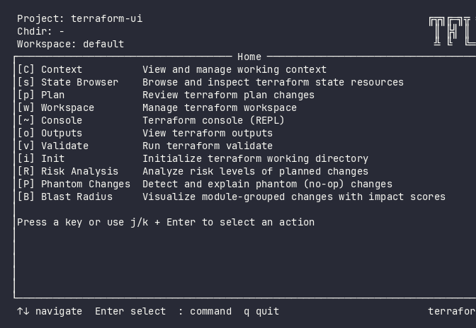
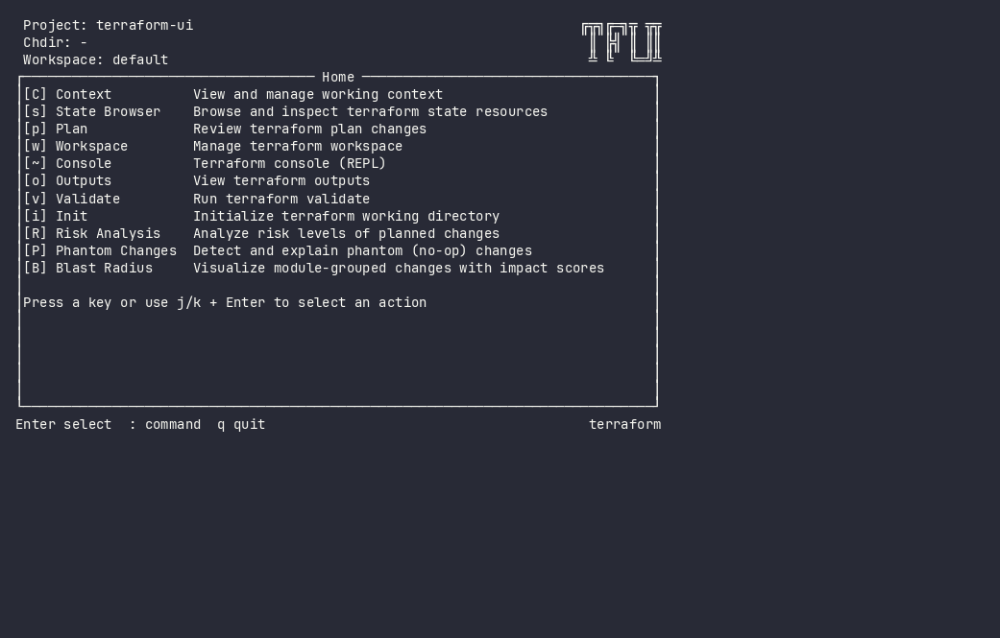
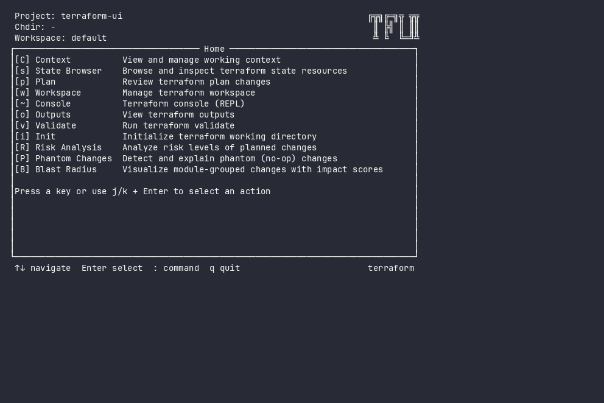
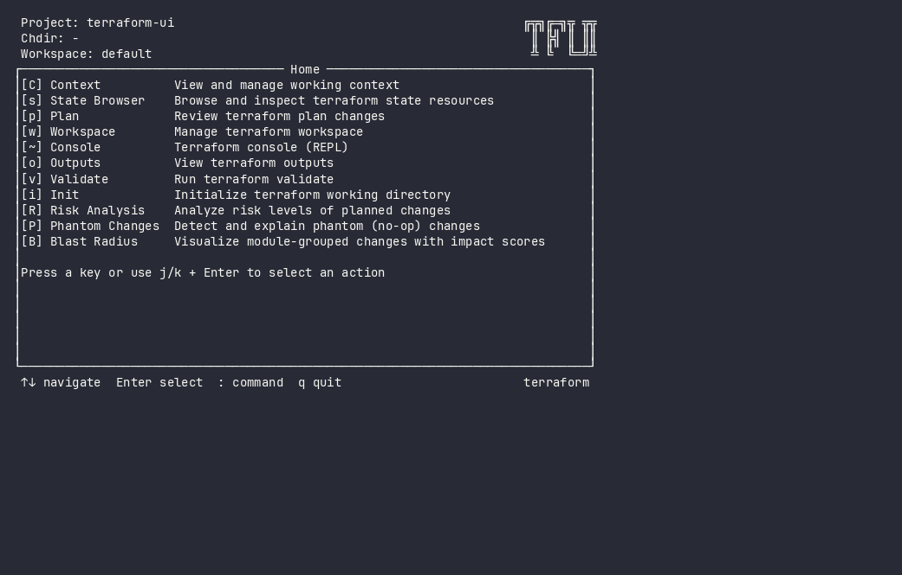

# terraform-ui - Stop reading terraform plan diffs in raw text.

> k9s for Terraform. Navigate it, don't scroll it.



---

## You know the feeling.

200 lines of `terraform plan` output. Somewhere in there, a database is about to be destroyed. You're scanning for the word "destroy" like it's 2005 and you're grepping production logs by hand.

You find it — on line 847, between two tag updates.

**terraform-ui sees what you'd miss.**

---

## Plan Review

Navigate changes as a tree. Expand attribute diffs inline. Risk badges surface the critical delete hiding between tag updates.



Every change is classified immediately: `[CRITICAL]` `[HIGH]` `[medium]` `[low]`. No scanning. No guessing. The dangerous change jumps at you — not the other way around.

---

## Pin & Target

Pin the resources you care about. Apply only those — no `--target` flags to type, no copy-paste mistakes.


One key (`space`) to pin. One key (`a`) to apply. The tool handles the rest: replans with your targets, shows you exactly what will happen, asks for confirmation.

---

## Risk Analysis

Every change classified: critical, high, medium, low. The RDS destroy doesn't hide between tag updates anymore.



Resource-specific rules: deleting a database is critical. Updating a security group CIDR from `10.0.0.0/8` to `0.0.0.0/0`? That's high. A tag change? Low. You see the breakdown before you do anything irreversible.

---

## State Browser

Browse, search, inspect. Delete and move with confirmation — not with typos.



Fuzzy search across hundreds of resources. Inspect full attribute JSON. Taint, untaint, import, move — with safety prompts instead of naked CLI commands.

---

## Phantom Changes

Terraform says "1 to change" but nothing actually changes. tfui detects cosmetic diffs — null vs absent, array reorder, provider normalization — and marks them.


Stop chasing ghost diffs. Stop second-guessing whether that "update in-place" is real. Phantom detection tells you which changes are noise.

---

## Try it now

```bash
brew install lmarqs/tap/tfui

# Try on your own plan — no config needed
terraform show -json tfplan.out | tfui --plan -

# Or use a demo fixture
curl -sL https://raw.githubusercontent.com/lmarqs/terraform-ui/main/demo/fixtures/plan-large.json -o /tmp/plan.json
tfui --plan /tmp/plan.json
```

No config. No account. No cloud service. Just your terminal.

Works with any existing `terraform show -json` output. Pipe it in, navigate immediately.

---

## Or try without installing

```bash
docker run -it ghcr.io/lmarqs/terraform-ui:demo
```

---

## Built for infrastructure engineers who value precision.

- **Single binary.** Zero runtime dependencies. Download and run.
- **Keyboard-driven.** No mouse required. Vim-style navigation.
- **Works with Terraform, OpenTofu, and Terragrunt.** One tool, all backends.
- **Your data never leaves your machine.** Local-only. No telemetry. No cloud.
- **Plugin architecture.** Every feature is a plugin. Extend or disable as needed.

---

## What you get

| Without tfui | With tfui |
|---|---|
| 200 lines of unstructured plan output | Navigable tree with expand/collapse |
| Manual scanning for destructive changes | Inline risk badges: `[CRITICAL]` to `[low]` |
| `terraform apply -target=...` with typos | Pin with `space`, apply with `a` |
| `terraform state rm` with no confirmation | Interactive state browser with safety prompts |
| Phantom diffs you chase for 20 minutes | Automatic detection and marking |
| Switching between 5 terminal windows | One TUI, one keyboard, every operation |

---

## Install

```bash
# Homebrew
brew install lmarqs/tap/tfui

# Go install
go install github.com/lmarqs/terraform-ui/cmd/tfui@latest

# Binary download
curl -sL https://github.com/lmarqs/terraform-ui/releases/latest/download/tfui_linux_amd64.tar.gz | tar xz
sudo mv tfui /usr/local/bin/
```

[Getting Started](guides/getting-started.md) | [GitHub](https://github.com/lmarqs/terraform-ui) | [CLI Reference](reference/cli-reference.md)
